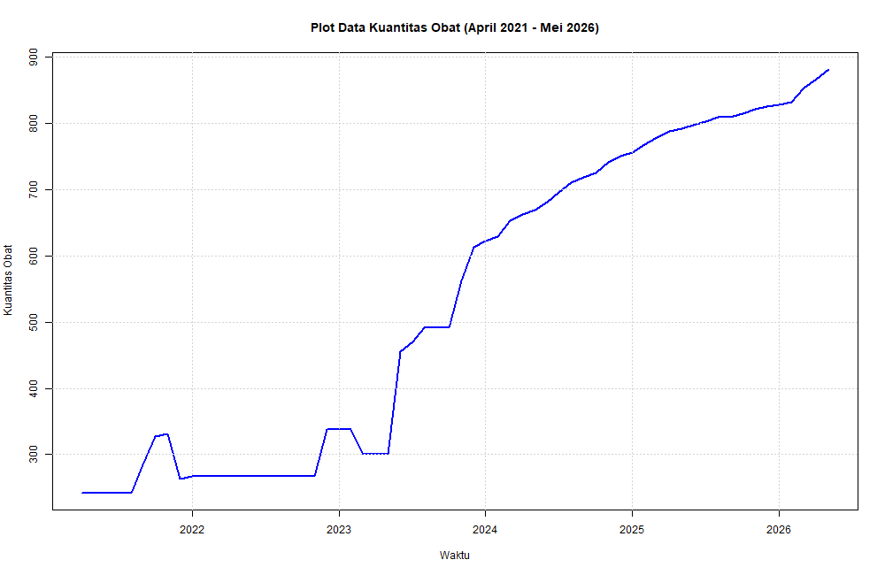
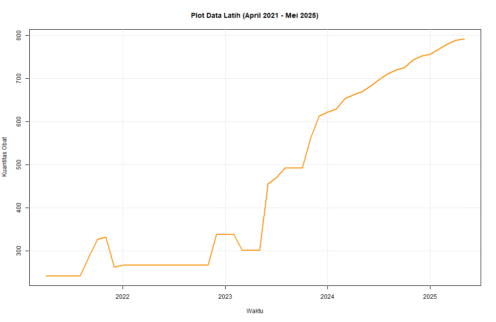
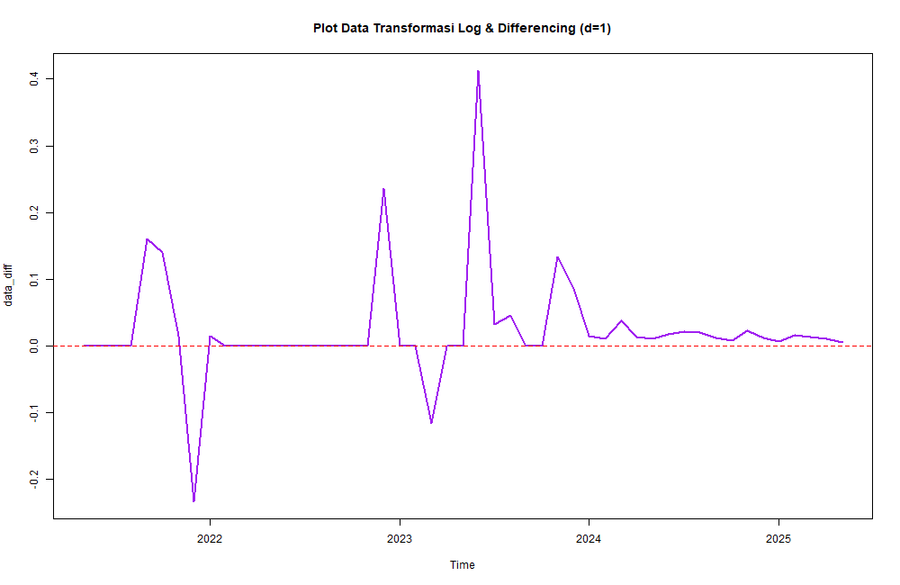
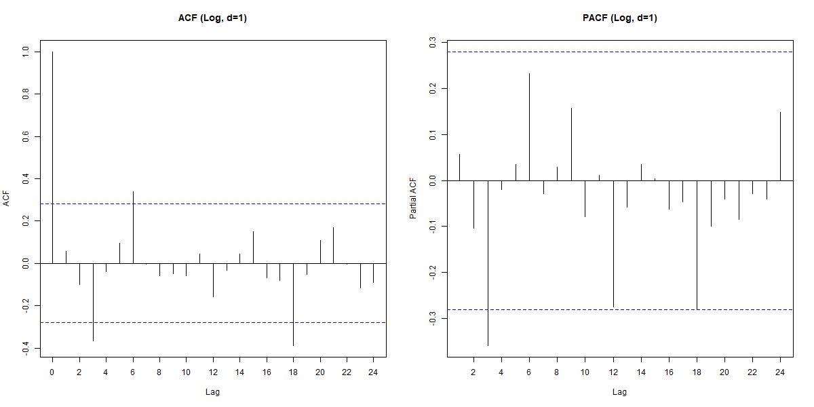
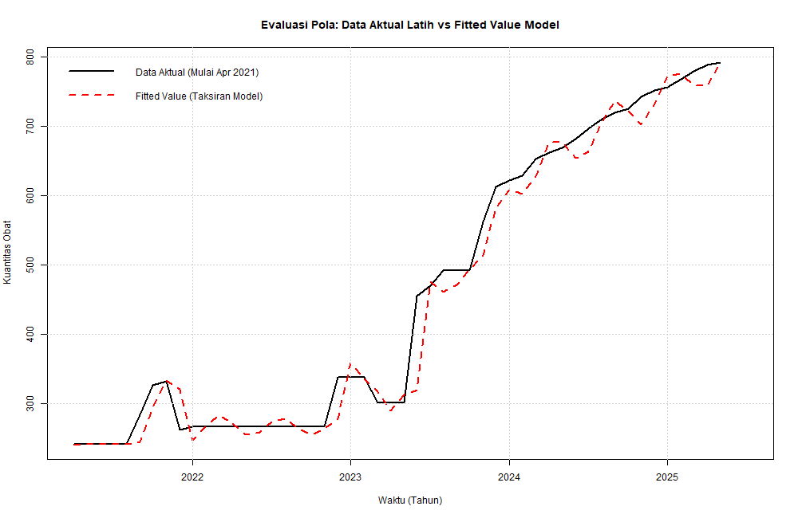
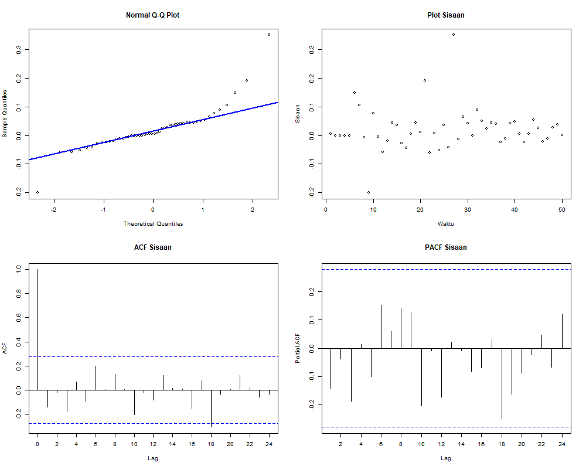
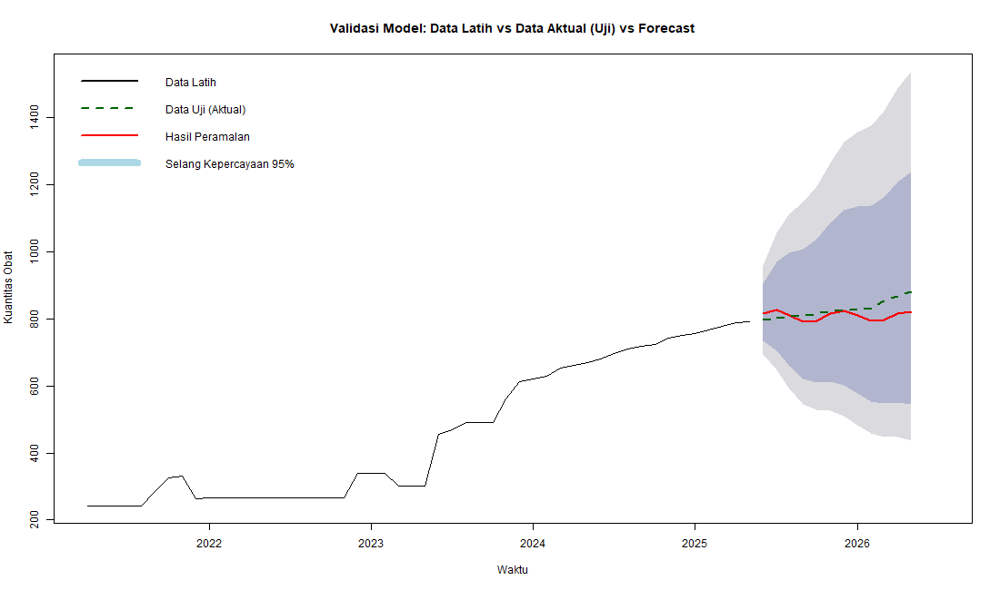
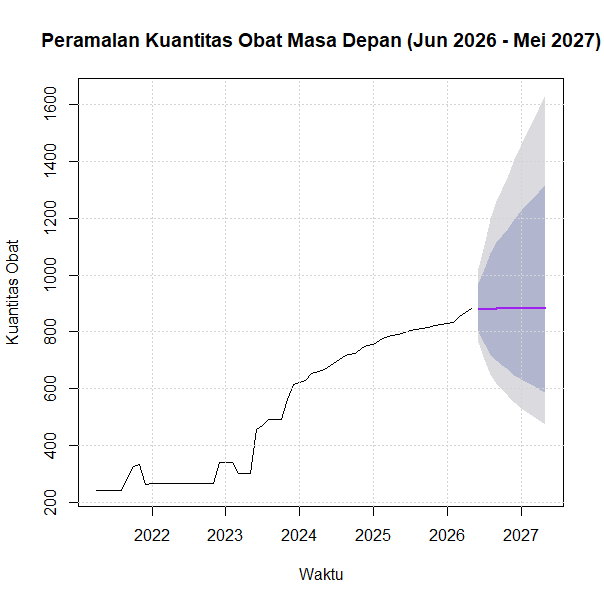
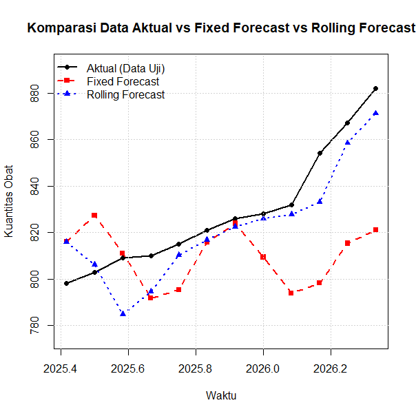

<div align="center">

# Peramalan Kuantitas Obat Generik RSJ Menur Surabaya dengan ARIMA Box-Jenkins

**Analisis deret waktu untuk rasionalisasi dan proyeksi kebutuhan obat generik bulanan RSJ Menur Surabaya menggunakan metode ARIMA Box-Jenkins**


*Model diidentifikasi murni lewat interpretasi visual ACF/PACF, tanpa `auto.arima()` maupun EACF*

</div>

---

## Data

Data yang digunakan merupakan bagian dari dataset publik pengadaan obat bulanan di RS Menur Surabaya.

| Detail | Keterangan |
|---|---|
| **Sumber Data** | [Open Data Provinsi Jawa Timur - Jumlah Pengadaan Obat Berdasarkan Golongan Obat](https://opendata.jatimprov.go.id/dataset/jumlah-pengadaan-obat-berdasarkan-golongan-obat-3) |
| **File Olahan** | `Book1.xlsx` (filter pada kategori obat generik) |
| **Periode Terpakai** | April 2021 – Mei 2026 (62 observasi bulanan) |
| **Data Latih (Train)** | 50 bulan (April 2021 – Mei 2025) |
| **Data Uji (Test)** | 12 bulan (Juni 2025 – Mei 2026) |

> 📌 **Catatan Pengolahan Data:** Dataset asli dari portal Open Data Jatim memiliki rentang waktu yang lebih panjang dan mencakup berbagai golongan obat. Untuk fokus penelitian ini, data difilter khusus pada kategori **obat generik** dengan rentang periode **April 2021 hingga Mei 2026** guna menjaga konsistensi deret waktu dan menghindari *structural break* akibat perbedaan pola pencatatan historis lama.

## Metodologi

1. Uji stasioneritas ragam (Box-Cox vs transformasi log)
2. Uji stasioneritas rataan (ADF & KPSS)
3. Differencing d=1
4. Identifikasi model tentatif dari plot ACF/PACF
5. Uji signifikansi parameter (coeftest) dan white noise (Ljung-Box) untuk tiap kandidat
6. Pemilihan model berdasarkan AICc terkecil di antara kandidat yang lolos signifikansi dan white noise
7. Uji overfitting terhadap model final (order p+1, q+1, dan gabungan keduanya)
8. Diagnostik sisaan (normalitas dan white noise)
9. Backtesting fixed forecast dan rolling forecast (walk-forward)
10. Forecast 12 bulan ke depan dari model yang direfit ke seluruh data

Grid search p(0-3) x q(0-3) turut disertakan sebagai pembanding di lampiran, namun bukan dasar pemilihan model utama. Identifikasi model tetap mengacu pada plot ACF/PACF sesuai ketentuan tugas.

## Hasil

Model terpilih: **ARIMA(2,1,2)** dengan transformasi log (λ=0)

| Kriteria | Hasil |
|---|---|
| Signifikansi parameter | Semua signifikan |
| White noise (Ljung-Box) | Lolos |
| AICc | -96.74 |
| MAPE fixed forecast | 3.11% |
| MAPE rolling forecast | 1.20% |

Rolling forecast jauh lebih akurat dibanding fixed forecast, karena model direfit tiap bulan dengan data terbaru sehingga error tidak terakumulasi ke horizon yang jauh.

## Visualisasi

| | |
|---|---|
|  |  |
| **Data penuh (Apr 2021 - Mei 2026)** | **Data latih (Apr 2021 - Mei 2025)** |
|  |  |
| **Log & differencing (d=1)** | **ACF & PACF data diff** |
|  |  |
| **Fitted vs aktual (data latih)** | **Diagnostik sisaan** |
|  |  |
| **Validasi forecast vs data uji** | **Forecast Jun 2026 - Mei 2027** |
|  | |
| **Komparasi fixed vs rolling forecast** | |

Semua gambar di atas dihasilkan otomatis oleh script (lihat bagian *Cara Menjalankan*), tidak perlu screenshot manual.

## Keterbatasan

- Residual model final tidak normal (Shapiro-Wilk p = 1.8e-06). Titik forecast tetap valid secara asimtotik, namun selang kepercayaan forecast yang diasumsikan normal menjadi kurang bisa diandalkan, terutama pada horizon yang jauh.
- Model tidak sepenuhnya stabil saat direfit ke seluruh data. Saat difit ulang pada 62 observasi penuh, parameter ar1 dan ma1 menjadi tidak signifikan, berbeda dari saat model difit pada 50 data latih.
- Selang kepercayaan forecast masa depan melebar cukup jauh pada bulan-bulan akhir, konsekuensi dari model I(1) yang dikombinasikan dengan residual non-normal.

## Struktur Repo

```
├── Analisis_Obat_Book1_Final.R          # script utama
├── Book1.xlsx                            # data
├── Hasil_Analisis_Obat_Book1_Final.txt   # output lengkap dari sink()
├── images/                               # 9 plot, ter-export otomatis oleh script
│   ├── 01_plot_data_penuh.png
│   ├── 02_plot_data_latih.png
│   ├── 03_plot_diff.png
│   ├── 04_acf_pacf.png
│   ├── 05_fitted_vs_aktual.png
│   ├── 06_diagnostik_sisaan.png
│   ├── 07_validasi_forecast.png
│   ├── 08_forecast_masa_depan.png
│   └── 09_fixed_vs_rolling.png
├── 1_Tabel_Komparasi_Model.csv
├── 1b_Lampiran_Grid_Search_Lengkap.csv
├── 2_Tabel_Hasil_Backtest.csv
├── 3_Tabel_Rolling_Forecast.csv
└── README.md
```

## Cara Menjalankan

Install library yang dibutuhkan:

```r
install.packages(c("readxl", "forecast", "tseries", "MASS", "lmtest"))
```

Sesuaikan `setwd()` di baris awal script ke folder tempat `Book1.xlsx` disimpan, lalu jalankan script dari atas ke bawah. Script akan otomatis membuat folder `images/` dan menyimpan 9 plot ke dalamnya, serta menyimpan semua output analisis ke file txt dan csv di working directory yang sama.

## Catatan Metode

Analisis ini sengaja tidak menggunakan `auto.arima()` maupun EACF untuk identifikasi model. Seluruh identifikasi model murni berdasarkan interpretasi visual plot ACF dan PACF, sesuai ketentuan tugas.
